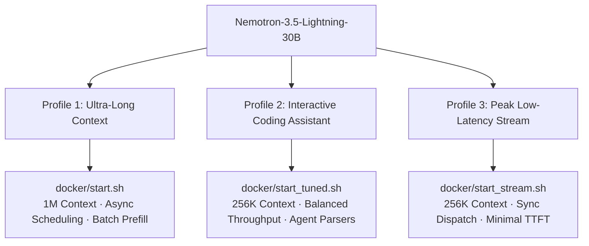

# Future Improvements & Roadmap (NEXT_STEPS.md)

This document outlines architectural explorations, runtime optimizations, and planned enhancements for running **Nemotron-3.5-Lightning-30B-A3B-NVFP4 + DSpark** on NVIDIA DGX Spark workstations.

---

## 1. Single-Stream & Low-Latency Dispatch Optimization

### A. Scheduler Dispatch Profiling
- **Synchronous vs. Asynchronous Scheduling:**
  - `--async-scheduling` decouples CPU scheduling from GPU execution using a background worker thread, benefiting multi-client concurrency ($c \ge 5$).
  - For single-stream interactive agent turns ($c = 1$, typical for coding assistants like Claude Code and Continue), asynchronous event synchronization can introduce per-token dispatch overhead.
  - **Next Step:** Introduce a low-latency synchronous runner option that bypasses background thread synchronization to minimize Time-to-First-Token (TTFT) and per-token decode latency on single sessions.

### B. Prefill Scheduling Calibration
- **Chunked Prefill Evaluation:**
  - Dynamic chunking (`--enable-chunked-prefill`) helps prevent large prompt prefills from starving concurrent decode streams.
  - For single-client interactive workloads, disabling chunk-splitting checks allows the scheduler loop to execute with fewer CPU instructions per step.
  - **Next Step:** Benchmark chunked vs. non-chunked prefill across representative agent context sizes (2K–32K tokens).

### C. Clean Engine Execution & Memory Footprint
- **Native Release Path Execution:**
  - Execute stock `vllm/vllm-openai:v0.27.1` paths directly without custom python file volume mounts to ensure pre-compiled CUDA graph paths and fast kernel dispatches run unencumbered.
- **Host & Allocator Memory Management:**
  - Standardize automated page cache reclamation (`sudo sync && sudo sysctl -w vm.drop_caches=3`) prior to container launches to guarantee unified memory buffers are contiguous.
  - Pin `--gpu-memory-utilization 0.80` to strike the optimal balance between KV cache pool size and CUDA graph buffer allocation without fragmentation.

---

## 2. Speculative Decoding Exploration (DSpark)

### A. Speculative Draft Depth Sweep
- Currently configured with `num_speculative_tokens: 3`.
- DSpark's semi-autoregressive drafting mechanism generates draft blocks in a single parallel pass with sequential Markov head bias.
- **Next Step:** Systematically evaluate draft token depths ($K = 3, 4, 5, 8$) across distinct workload categories:
  - **Code Generation & Boilerplate:** High predictable structure (higher draft acceptance rate expected).
  - **Tool Calling & JSON Generation:** Strict schema constraints.
  - **Chain-of-Thought Reasoning:** Dense token-by-token logic.

### B. Acceptance Rate & Efficiency Telemetry
- **Next Step:** Implement automated acceptance rate telemetry logging in benchmark scripts to quantify how many draft tokens are accepted per step under varying context depths.

---

## 3. Kernel & Hardware-Level Accelerations

### A. Tensor Core & Marlin MoE Tuning
- **Marlin Kernel Atomic Reductions:**
  - Verify speedups from `VLLM_MARLIN_USE_ATOMIC_ADD=1` across NVFP4 MoE expert routing layers.
- **Matrix Multiplication & Forward Compatibility:**
  - Test `TORCH_MATMUL_PRECISION=high` alongside `TORCH_ALLOW_TF32_CUBLAS_OVERRIDE=1` and `NVIDIA_TF32_OVERRIDE=1` for float32 projection layers.
  - Set `FLASHINFER_DISABLE_VERSION_CHECK=1` and `NVIDIA_FORWARD_COMPAT=1` for seamless kernel dispatch.

### B. CUDA Stream Dispatch Serialization
- Evaluate `CUDA_DEVICE_MAX_CONNECTIONS=1` to enforce strict sequential kernel launch queues, minimizing context switching on single-GPU workstations.

---

## 4. Preserving & Enhancing Agent Intelligence (`tool-eval-bench`)

Maintaining state-of-the-art agent capabilities (reasoning depth, tool selection precision, and parameter accuracy) is a top priority.

### A. Non-Compromise Guarantee of Speculative Verification
- DSpark draft tokens are strictly verified by the 30B base model via rejection sampling.
- Output probabilities and sampling distributions remain mathematically equivalent to target model execution.

### B. Parser & Schema Robustness
- Continue verifying compatibility with:
  - `--reasoning-parser nemotron_v3` for structured `<thought>` extraction.
  - `--tool-call-parser qwen3_coder` for multi-step tool execution.
  - `--enable-auto-tool-choice` for autonomous decision making.

### C. Multi-Trial Deterministic Evaluation
- Automate multi-trial runs (`--mode trials --seed 42 --trials 3`) to verify that latency and throughput improvements maintain or exceed the current **87/100 smarts score** with lower median turn latency (< 1.0s).

---

## 5. Multi-Profile Deployment Architecture

To support different user workflows without manual flag editing, organize container launch scripts into three distinct profiles:



1. **`start.sh` (1M Context Standard):** For massive document analysis, repository-wide indexing, and deep context processing.
2. **`start_tuned.sh` (256K Interactive Tuned):** Balanced configuration optimized for concurrent coding assistants (Claude Code, Continue, Open WebUI).
3. **`start_stream.sh` (Ultra Low-Latency Stream Profile Specification):**

```bash
#!/usr/bin/env bash
# docker/start_stream.sh — Ultra Low-Latency Synchronous Profile
set -euo pipefail

CONTAINER_NAME="${CONTAINER_NAME:-spark-brain}"
VLLM_IMAGE="${VLLM_IMAGE:-vllm/vllm-openai:v0.27.1}"
MODEL_ID="${MODEL_ID:-nvidia/NVIDIA-Nemotron-3.5-Lightning-30B-A3B-NVFP4}"
SPECULATIVE_MODEL_ID="${SPECULATIVE_MODEL_ID:-nvidia/NVIDIA-Nemotron-3.5-Lightning-30B-A3B-NVFP4-DSpark}"
SERVED_MODEL_NAME="${SERVED_MODEL_NAME:-nemotron-3.5-lightning}"
HOST="${HOST:-0.0.0.0}"
PORT="${PORT:-8000}"
GPU_MEMORY_UTILIZATION="${GPU_MEMORY_UTILIZATION:-0.80}"
MAX_MODEL_LEN="${MAX_MODEL_LEN:-262144}"
NUM_SPECULATIVE_TOKENS="${NUM_SPECULATIVE_TOKENS:-3}"

if docker ps -a --format '{{.Names}}' | grep -q "^${CONTAINER_NAME}$"; then
  docker stop "$CONTAINER_NAME" >/dev/null 2>&1 || true
  docker rm "$CONTAINER_NAME" >/dev/null 2>&1 || true
fi

if sudo -n true 2>/dev/null; then
  sudo sync && sudo sysctl -w vm.drop_caches=3 >/dev/null 2>&1 || true
fi

docker run -d --name "$CONTAINER_NAME" \
  --gpus all \
  --restart=unless-stopped \
  --ipc=host \
  --network host \
  --shm-size=32gb \
  --ulimit memlock=-1 \
  --ulimit stack=67108864 \
  -v "$HOME/.cache/huggingface:/root/.cache/huggingface" \
  -v "$HOME/.cache/triton:/root/.cache/triton" \
  -v "$HOME/.cache/vllm:/root/.cache/vllm" \
  -e TRITON_CACHE_DIR=/root/.cache/triton \
  -e VLLM_MARLIN_USE_ATOMIC_ADD=1 \
  -e TORCH_MATMUL_PRECISION=high \
  -e TORCH_ALLOW_TF32_CUBLAS_OVERRIDE=1 \
  -e NVIDIA_TF32_OVERRIDE=1 \
  -e CUDA_DEVICE_MAX_CONNECTIONS=1 \
  -e FLASHINFER_DISABLE_VERSION_CHECK=1 \
  -e NVIDIA_FORWARD_COMPAT=1 \
  -e VLLM_HTTP_TIMEOUT_KEEP_ALIVE=600 \
  "$VLLM_IMAGE" \
    --model "$MODEL_ID" \
    --host "$HOST" \
    --port "$PORT" \
    --served-model-name "$SERVED_MODEL_NAME" \
    --tensor-parallel-size 1 \
    --moe-backend marlin \
    --kv-cache-dtype fp8 \
    --max-model-len "$MAX_MODEL_LEN" \
    --enable-prefix-caching \
    --mamba-backend flashinfer \
    --mamba-cache-mode align \
    --gpu-memory-utilization "$GPU_MEMORY_UTILIZATION" \
    --speculative-config "{\"method\":\"dspark\",\"model\":\"$SPECULATIVE_MODEL_ID\",\"num_speculative_tokens\":$NUM_SPECULATIVE_TOKENS}" \
    --reasoning-parser nemotron_v3 \
    --tool-call-parser qwen3_coder \
    --enable-auto-tool-choice
```

---

## 6. Continuous Benchmarking & Validation Protocol

To implement and verify all improvements in a new session:

1. **Start the Low-Latency Profile:**
   ```bash
   bash docker/start_stream.sh
   # Wait for readiness
   curl -sf http://localhost:8000/health && echo OK
   ```

2. **Verify Tool Smarts First (Ensuring No Regressions):**
   ```bash
   # Quick smoke test
   uv run benchmark/benchmark_smarts.py --mode short
   # Deterministic 3-trial run (target: 87/100 score, < 1.0s median turn latency)
   uv run benchmark/benchmark_smarts.py --mode trials --seed 42 --trials 3
   ```

3. **Verify Decode Throughput & Context Scaling:**
   ```bash
   # Single stream decode speed (target: >= 125.13 t/s)
   uv tool run --from llama-benchy llama-benchy \
     --base-url http://localhost:8000/v1 \
     --model nvidia/NVIDIA-Nemotron-3.5-Lightning-30B-A3B-NVFP4 \
     --served-model-name nemotron-3.5-lightning \
     --depth 0 --pp 0 --tg 128 --concurrency 1

   # Full multi-context sweep
   uv run benchmark/benchmark_speed_arena.py --save-result benchmark/results_stream.csv
   ```
