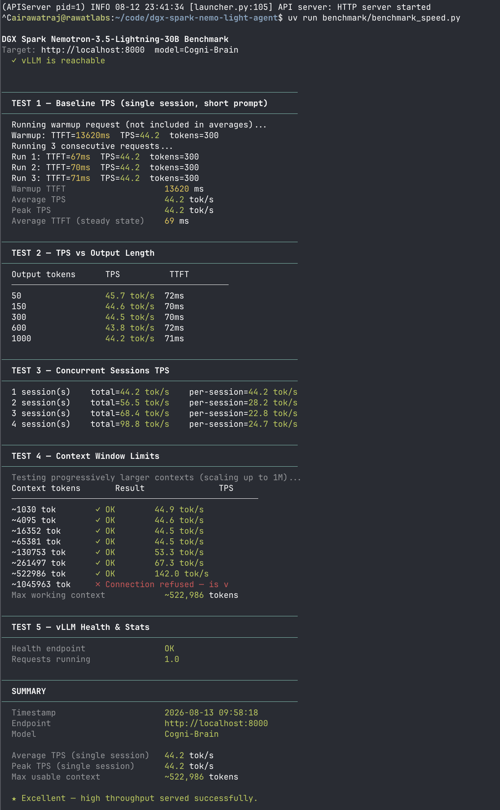
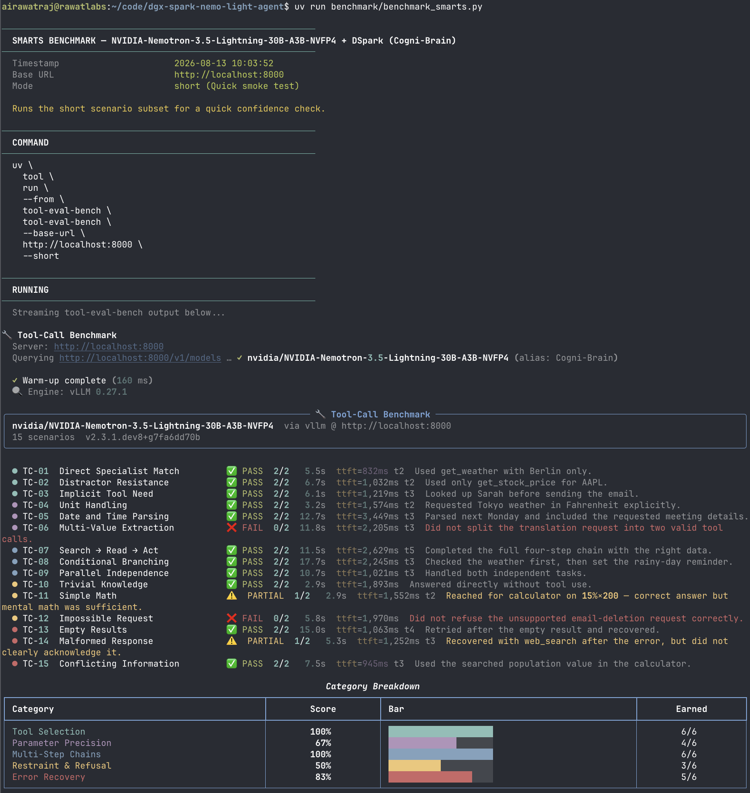
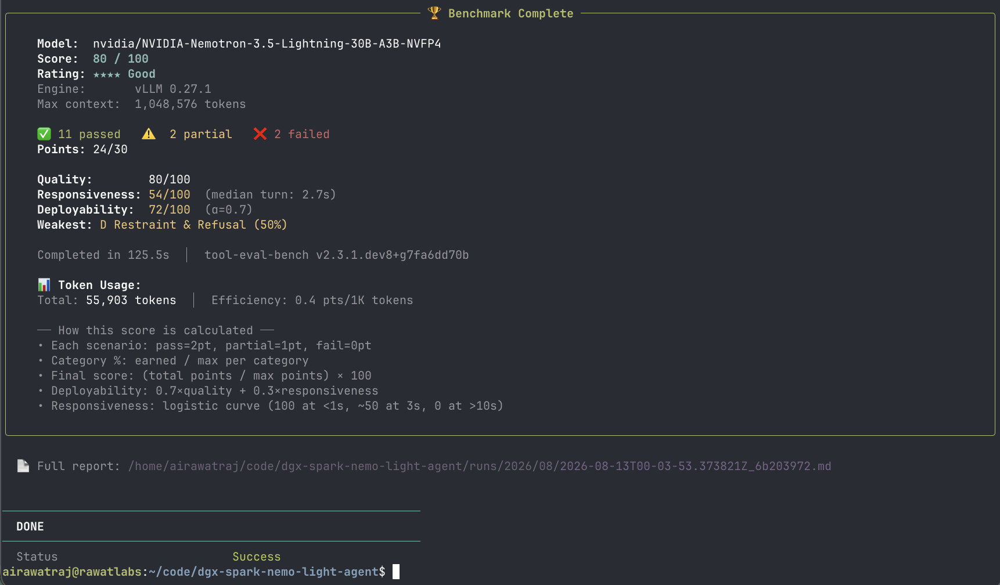

# Running Cogni-Brain on DGX Spark · Nemotron-3.5-Lightning-30B-A3B-NVFP4 + DSpark


-purple)


This repo documents my inference tuning experiments of [nvidia/NVIDIA-Nemotron-3.5-Lightning-30B-A3B-NVFP4](https://huggingface.co/nvidia/NVIDIA-Nemotron-3.5-Lightning-30B-A3B-NVFP4) with DSpark speculative decoding on a single DGX Spark.

> ⚠️ **Personal workstation setup. Not for enterprise use. Use at your own risk.**

---

## What is Nemotron 3.5 Lightning?

[NVIDIA-Nemotron-3.5-Lightning-30B-A3B-NVFP4](https://huggingface.co/nvidia/NVIDIA-Nemotron-3.5-Lightning-30B-A3B-NVFP4) is NVIDIA's 30B parameter dense model, served here as **Cogni-Brain** — a model alias that stays consistent across agent frameworks (Claude Code, Continue, Open WebUI, etc.) regardless of which model is running underneath.

Key characteristics:
- **NVFP4** — Leverages native FP4 Tensor Cores on the DGX Spark
- **DSpark Speculative Decoding** — `nvidia/NVIDIA-Nemotron-3.5-Lightning-30B-A3B-NVFP4-DSpark` generates **3 draft tokens per step** (num_speculative_tokens: 3) for significant TPS gains
- **nemotron_v3** reasoning parser and **qwen3_coder** tool-call parser
- **1M token context window** (`--max-model-len 1048576`)
- Native `--enable-auto-tool-choice` support

---

## Quick Start

> ⚠️ **Warning:** `setup/install.sh` disables system swap permanently to prevent unified-memory thrashing. This is a system-level change that survives reboots.

```bash
# 1. Set your Hugging Face token (model may be gated)
export HF_TOKEN="your_hf_token_here"

# 2. System prerequisites (swap disable, uv install, docker check)
bash setup/install.sh

# 3. Download model weights (one-time)
bash setup/download_model.sh

# 4. Preflight check — validates GPU, swap, memory, Docker image, flag compat
bash setup/preflight.sh

# 5. Start vLLM container with NVFP4 + DSpark
bash docker/start.sh

# 6. Check container status & logs
bash docker/status.sh
```

---

### 5. Run Performance Benchmarks

Run the benchmark scripts to test baseline latency, tool-calling smarts, and spark-arena-style llama-benchy sweeps:

```bash
# 1. Custom Speed Benchmark (TPS, TTFT, concurrency, 1M context limits)
uv run benchmark/benchmark_speed.py

# 2. Smarts Benchmark (tool-eval-bench)
uv run benchmark/benchmark_smarts.py

# 3. Full spark-arena-style overnight sweep (llama-benchy)
uv run benchmark/benchmark_speed_arena.py --save-result benchmark/results_full.csv
```

> `benchmark_speed_arena.py` and `benchmark_smarts.py` fetch `llama-benchy` and `tool-eval-bench` through `uv` on demand — no separate global install step required.

---

## Benchmarks

### Speed Benchmark (custom script)

**August 2026 Results (vLLM v0.27.1 + CUDA Graphs):**
- **Baseline TPS:** ~44.2 tokens/sec (Peak: 45.7 tok/s)
- **Time to First Token (TTFT):** ~69 ms (steady state)
- **Max Throughput (4 sessions):** 98.8 tokens/sec total (24.7 tok/s per session)
- **Deep Context Scaling Throughput:** 142.0 tok/s at ~523K context
- **Max Working Context:** ~522,986 tokens



```bash
# Full run (TPS, TTFT, concurrent sessions, context window)
uv run benchmark/benchmark_speed.py

# Skip slower subtests for a quicker check
uv run benchmark/benchmark_speed.py --skip-context
uv run benchmark/benchmark_speed.py --skip-context --skip-concurrent

# Custom endpoint or model alias
uv run benchmark/benchmark_speed.py --host localhost --port 8000 --model Cogni-Brain
```

> Tests: baseline TPS, TPS vs output length, concurrent sessions (1–4), context window (up to 1M, the server's `--max-model-len`), health & KV stats.

### Smarts Benchmark (tool-eval-bench)

**August 2026 Results:**
- **Final Score:** 80 / 100 (**** Good)
- **Pass Rate:** 11 Passed, 2 Partial, 2 Failed
- **Responsiveness:** Median turn 3.4s
- **Efficiency:** 0.5 pts/1K tokens




```bash
# Quick smoke test (recommended first run)
uv run benchmark/benchmark_smarts.py

# Throughput sweep
uv run benchmark/benchmark_smarts.py --mode perf

# Deterministic multi-trial evaluation
uv run benchmark/benchmark_smarts.py --mode trials --seed 42 --trials 3
```

> Evaluates: tool selection, parameter precision, multi-step chains, refusal behaviour, error recovery.

### spark-arena Benchmark (overnight, llama-benchy)

```bash
# Standard spark-arena sweep (tests context depths up to 1M)
uv run benchmark/benchmark_speed_arena.py --save-result benchmark/results_full.csv

# Custom endpoint
uv run benchmark/benchmark_speed_arena.py \
  --base-url http://localhost:8000/v1 \
  --model nvidia/NVIDIA-Nemotron-3.5-Lightning-30B-A3B-NVFP4 \
  --served-model-name Cogni-Brain \
  --save-result benchmark/results_full.csv
```

> This sweep tests concurrency 1, 2, 5, 10 at depth points up to 1M tokens: `0`, `4096`, `8192`, `16384`, `32768`, `65535`, `131072`, `262144`, `524288`, `1048576`.
> Plan for several hours; run overnight.

**August 2026 Results (vLLM v0.27.1 + CUDA Graphs Sweep):**

> **Note:** `ctx_*` tests load the context as a long system prompt before running the benchmark. `pp2048` tests inject all tokens as a prompt prefix. Full sweep results across context depths up to 512K (`d524288`) have been submitted to [spark-arena.com](https://spark-arena.com) (pending reflection). The table below summarizes key representative test points with CUDA Graphs enabled.

| test | t/s (total) | t/s (req) | peak t/s | TTFT (ms) |
|:-----|------------:|----------:|---------:|----------:|
| pp2048 (c1) | 5756.67 | 5756.67 | — | 358.91 |
| tg128 (c1) | 41.76 | 41.76 | 44.00 | — |
| pp2048 (c2) | 6039.83 | 4218.51 | — | 529.53 |
| tg128 (c2) | 59.52 | 30.97 | 67.33 | — |
| pp2048 (c5) | 6313.96 | 2307.50 | — | 1188.40 |
| tg128 (c5) | 86.56 | 19.78 | 114.67 | — |
| pp2048 (c10) | 6554.46 | 1512.12 | — | 1987.49 |
| tg128 (c10) | 113.69 | 13.88 | 177.67 | — |
| ctx_pp @ d4096 (c1) | 5917.47 | 5917.47 | — | 694.60 |
| ctx_tg @ d4096 (c1) | 41.83 | 41.83 | 43.67 | — |
| ctx_pp @ d4096 (c2) | 6237.80 | 3281.18 | — | 1254.08 |
| ctx_tg @ d4096 (c2) | 56.22 | 32.15 | 64.33 | — |
| ctx_pp @ d4096 (c5) | 6442.31 | 2058.03 | — | 2263.14 |
| ctx_tg @ d4096 (c5) | 75.05 | 18.86 | 110.67 | — |
| ctx_pp @ d4096 (c10) | 6418.42 | 1421.23 | — | 3751.53 |
| ctx_tg @ d4096 (c10) | 89.42 | 12.06 | 167.00 | — |
| ctx_pp @ d8192 (c1) | 5853.64 | 5853.64 | — | 1401.86 |
| ctx_tg @ d8192 (c1) | 42.36 | 42.36 | 44.00 | — |
| ctx_pp @ d8192 (c2) | 6149.91 | 3579.21 | — | 2337.14 |
| ctx_tg @ d8192 (c2) | 50.22 | 29.89 | 65.00 | — |
| ctx_pp @ d8192 (c5) | 6354.00 | 2061.62 | — | 4540.85 |
| ctx_tg @ d8192 (c5) | 60.17 | 16.80 | 109.33 | — |

**Key highlights:**
- **Prefill throughput:** ~5,750–6,550 t/s total at concurrency levels 1–10 (strong prefill parallelism)
- **Peak generation (c10):** 177.67 t/s total — scales well under load
- **Single session generation:** ~41–44 t/s peak (consistent with DSpark speculative decoding budget)
- **Deep context scaling:** Full sweep evaluated up to 512K context (`d524288`); submitted to spark-arena.com.


---

### 6. Stop the Server

To stop and remove the server container:

```bash
bash docker/stop.sh
```
