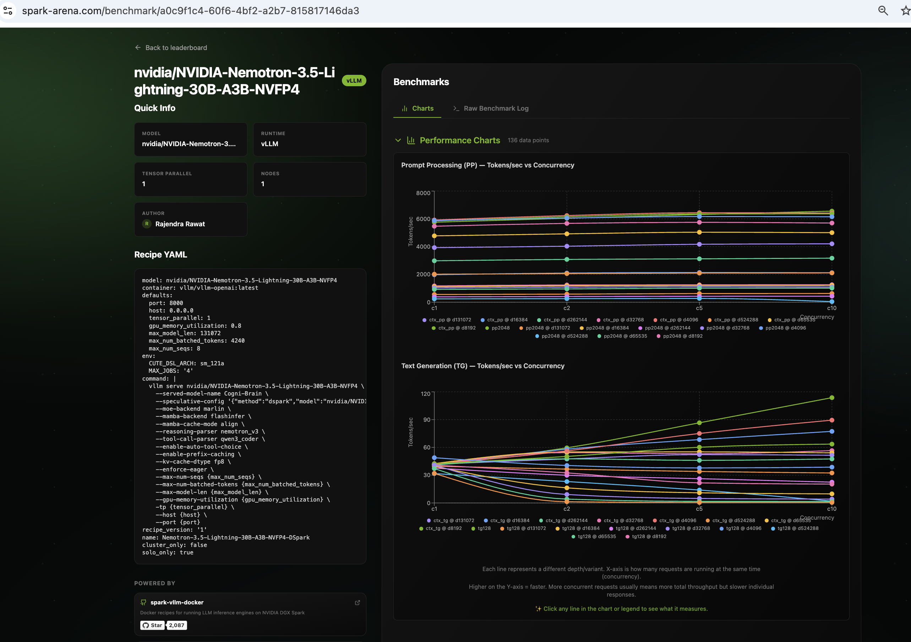

# Running Cogni-Brain on DGX Spark · Nemotron-3.5-Lightning-30B-A3B-NVFP4 + DSpark


-purple)


This repo documents my inference tuning experiments of [nvidia/NVIDIA-Nemotron-3.5-Lightning-30B-A3B-NVFP4](https://huggingface.co/nvidia/NVIDIA-Nemotron-3.5-Lightning-30B-A3B-NVFP4) with DSpark speculative decoding on a single DGX Spark.

> ⚠️ **Personal workstation setup. Not for enterprise use. Use at your own risk.**

---

## What is Nemotron 3.5 Lightning?

[NVIDIA-Nemotron-3.5-Lightning-30B-A3B-NVFP4](https://huggingface.co/nvidia/NVIDIA-Nemotron-3.5-Lightning-30B-A3B-NVFP4) is NVIDIA's 30B parameter dense model, served here as **Cogni-Brain** — a model alias that stays consistent across agent frameworks (Claude Code, Continue, Open WebUI, etc.) regardless of which model is running underneath.

Key characteristics:
- **NVFP4** — Leverages native FP4 Tensor Cores on the DGX Spark
- **DSpark Speculative Decoding** — `nvidia/NVIDIA-Nemotron-3.5-Lightning-30B-A3B-NVFP4-DSpark` generates **3 draft tokens per step** (num_speculative_tokens: 3) for significant TPS gains
- **nemotron_v3** reasoning parser and **qwen3_coder** tool-call parser
- **1M token context window** (`--max-model-len 1048576`)
- Native `--enable-auto-tool-choice` support

> [!NOTE]
> **Context Window Disclaimer (1M Model Capacity vs. Operational Latency):**
> 
> While Nemotron-3.5-Lightning-30B natively supports a **1M token context window** (`--max-model-len 1048576`), operational context scaling on a single DGX Spark node is bounded by prefill Time-To-First-Token (TTFT) and KV-cache memory dynamics:
> 
> - **128K context (`d131072 c1`):** TTFT is **33.36 seconds** — 🟢 *Optimal limit for live interactive agents (Claude Code, Continue, Open WebUI).*
> - **256K context (`d262144 c1`):** TTFT reaches **87.92 seconds** (~1.5 mins) — 🟡 *Usable for long document queries with relaxed timeouts.*
> - **512K context (`d524288 c1`):** TTFT reaches **260.12 seconds** (~4.3 mins) — 🔴 *Intended for offline batch processing.*
> - **1M context (`d1048576 c1`):** Extrapolates to **> 10–15 minutes** for prompt prefill alone. Most standard API clients and HTTP proxies will time out after 60–120s.
> 
> *Recommendation:* Keep `--max-model-len` at `131072` or `262144` for interactive agent use cases to maximize KV-cache memory pool throughput and prevent client timeouts.

---

## Quick Start

> ⚠️ **Warning:** `setup/install.sh` disables system swap permanently to prevent unified-memory thrashing. This is a system-level change that survives reboots.

```bash
# 1. Set your Hugging Face token (model may be gated)
export HF_TOKEN="your_hf_token_here"

# 2. System prerequisites (swap disable, uv install, docker check)
bash setup/install.sh

# 3. Download model weights (one-time)
bash setup/download_model.sh

# 4. Preflight check — validates GPU, swap, memory, Docker image, flag compat
bash setup/preflight.sh

# 5. Start vLLM container with NVFP4 + DSpark
# Option A: Standard 1M context configuration
bash docker/start.sh

# Option B: High-speed 256K interactive agent route (recommended for coding agents)
bash docker/start_tuned.sh

# 6. Check container status & logs
bash docker/status.sh
```

---

### Operational Modes

| Route | Script | Context Window | Optimizations | Recommended Use Case |
| :--- | :--- | :--- | :--- | :--- |
| **Standard Mode** | `docker/start.sh` | **1,048,576 tokens (1M)** | Conservative batching, wide sequence allocations | Long document analysis & 1M context research |
| **Interactive Agent Mode** | `docker/start_tuned.sh` | **262,144 tokens (256K)** | Async token scheduling, hardware TF32 acceleration, tight CUDA graph sizes | Interactive coding agents (Claude Code, Continue, Open WebUI) |

---

### Run Performance Benchmarks

Run the benchmark scripts to test baseline latency, tool-calling smarts, and spark-arena-style llama-benchy sweeps:

```bash
# 1. Custom Speed Benchmark (TPS, TTFT, concurrency, context limits)
uv run benchmark/benchmark_speed.py

# 2. Smarts Benchmark (tool-eval-bench)
uv run benchmark/benchmark_smarts.py

# 3. Full spark-arena-style sweep (llama-benchy)
uv run benchmark/benchmark_speed_arena.py --save-result benchmark/results_full.csv
```

> `benchmark_speed_arena.py` and `benchmark_smarts.py` fetch `llama-benchy` and `tool-eval-bench` through `uv` on demand — no separate global install step required.

---

## Benchmarks

### Speed Benchmark (custom script)

**August 2026 Results (vLLM v0.27.1 + CUDA Graphs):**
- **Baseline TPS:** ~44.2 tokens/sec (Peak: 45.7 tok/s)
- **Time to First Token (TTFT):** ~69 ms (steady state)
- **Max Throughput (4 sessions):** 98.8 tokens/sec total (24.7 tok/s per session)
- **Deep Context Scaling Throughput:** 142.0 tok/s at ~523K context
- **Max Working Context:** ~522,986 tokens


```bash
# Full run (TPS, TTFT, concurrent sessions, context window)
uv run benchmark/benchmark_speed.py

# Skip slower subtests for a quicker check
uv run benchmark/benchmark_speed.py --skip-context
uv run benchmark/benchmark_speed.py --skip-context --skip-concurrent

# Custom endpoint or model alias
uv run benchmark/benchmark_speed.py --host localhost --port 8000 --model Cogni-Brain
```

> Tests: baseline TPS, TPS vs output length, concurrent sessions (1–4), context window (up to 1M, the server's `--max-model-len`), health & KV stats.

### Smarts Benchmark (tool-eval-bench)

**August 2026 Results (Interactive Route):**
- **Final Score:** **87 / 100** (★★★★ Good)
- **Pass Rate:** 12 Passed, 2 Partial, 1 Failed
- **Responsiveness:** Median turn **1.1s**
- **Efficiency:** 0.5 pts/1K tokens


```bash
# Quick smoke test (recommended first run)
uv run benchmark/benchmark_smarts.py

# Throughput sweep
uv run benchmark/benchmark_smarts.py --mode perf

# Deterministic multi-trial evaluation
uv run benchmark/benchmark_smarts.py --mode trials --seed 42 --trials 3
```

> Evaluates: tool selection, parameter precision, multi-step chains, refusal behaviour, error recovery.

### spark-arena Benchmark (overnight, llama-benchy)

```bash
# Standard spark-arena sweep (automatically bounds test points to server max_model_len)
uv run benchmark/benchmark_speed_arena.py --save-result benchmark/results_full.csv

# Custom endpoint
uv run benchmark/benchmark_speed_arena.py \
  --base-url http://localhost:8000/v1 \
  --model nvidia/NVIDIA-Nemotron-3.5-Lightning-30B-A3B-NVFP4 \
  --served-model-name Cogni-Brain \
  --save-result benchmark/results_full.csv
```

<p align="center">
  <a href="https://spark-arena.com/benchmark/a0c9f1c4-60f6-4bf2-a2b7-815817146da3">
    
  </a>
</p>
<p align="center">
  <a href="https://spark-arena.com/benchmark/a0c9f1c4-60f6-4bf2-a2b7-815817146da3">Spark Arena community benchmark — Nemotron-3.5-Lightning-30B-A3B-NVFP4 on single DGX Spark</a>
</p>

**Interactive Route Results (256K Context + DSpark Acceleration):**

| test | t/s (total) | t/s (req) | peak t/s | TTFT (ms) |
|:-----|------------:|----------:|---------:|----------:|
| pp2048 (c1) | 6244.38 | 6244.38 | — | 330.59 |
| tg128 (c1) | 115.26 | 115.26 | 118.67 | — |
| pp2048 (c2) | 6576.88 | 4462.48 | — | 494.56 |
| tg128 (c2) | 130.85 | 76.59 | 165.33 | — |
| pp2048 (c5) | 7601.71 | 2315.77 | — | 1152.38 |
| tg128 (c5) | 180.48 | 49.84 | 285.33 | — |
| pp2048 (c10) | 7822.13 | 1372.97 | — | 2048.47 |
| tg128 (c10) | 221.00 | 34.12 | 440.33 | — |
| ctx_pp @ d4096 (c10) | 7941.10 | 1795.86 | — | 3361.90 |
| ctx_tg @ d4096 (c10) | 144.85 | 26.63 | 390.00 | — |
| ctx_pp @ d8192 (c1) | 7611.59 | 7611.59 | — | 1078.66 |
| ctx_tg @ d8192 (c1) | 104.23 | 104.23 | 106.82 | — |
| ctx_tg @ d32768 (c1) | 115.56 | 115.56 | 130.45 | — |
| ctx_tg @ d65535 (c1) | 97.75 | 97.75 | 103.72 | — |
| ctx_tg @ d131072 (c1) | 96.64 | 96.64 | 107.00 | — |
| ctx_tg @ d259000 (c1) | 76.11 | 76.11 | 125.41 | — |

**Key observations:**
- **Prefill throughput:** Reaches up to ~7,941 t/s at concurrency 10.
- **Concurrent generation:** Scales to 221.00 t/s (peak 440.33 t/s) under 10 concurrent sessions.
- **Context resilience:** Sustains 76.11–125.41 t/s out to 259,000 context tokens.


---

### 6. Stop the Server

To stop and remove the server container:

```bash
bash docker/stop.sh
```
