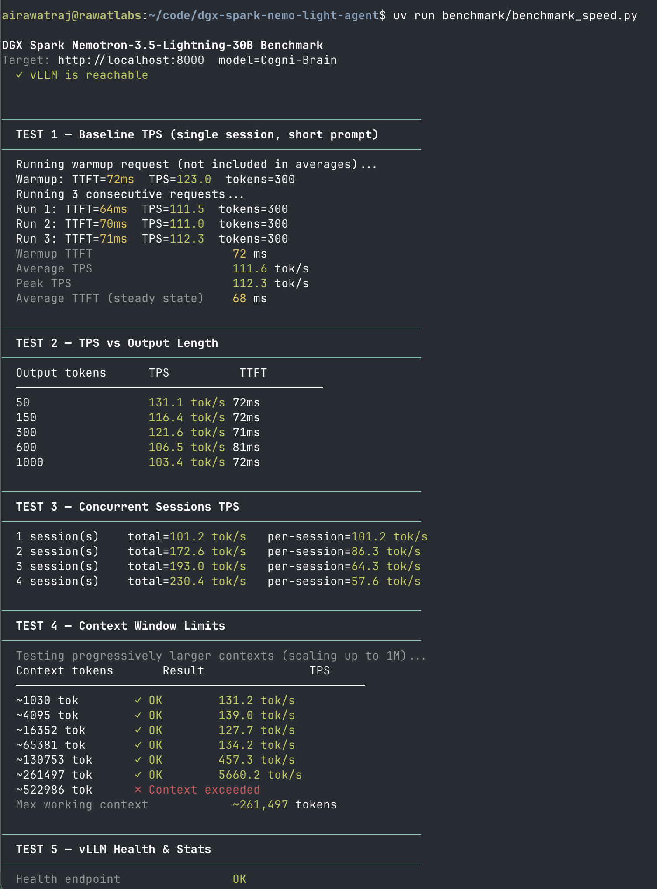
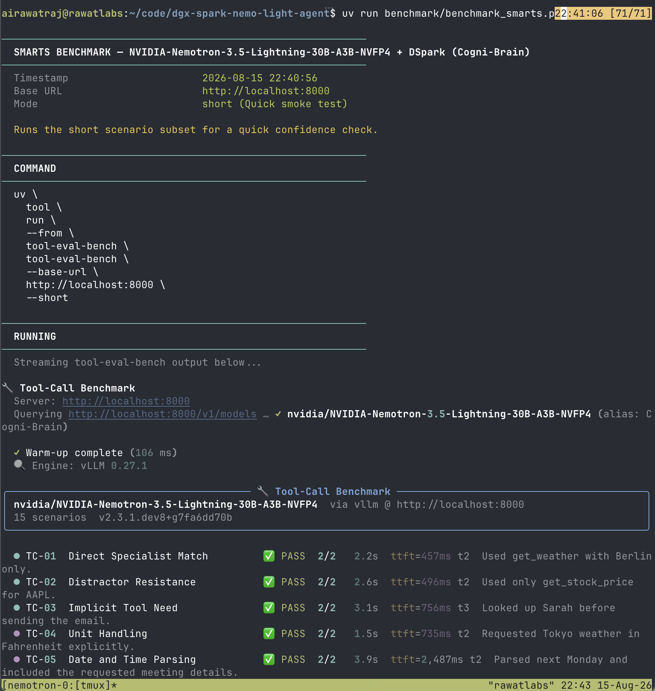
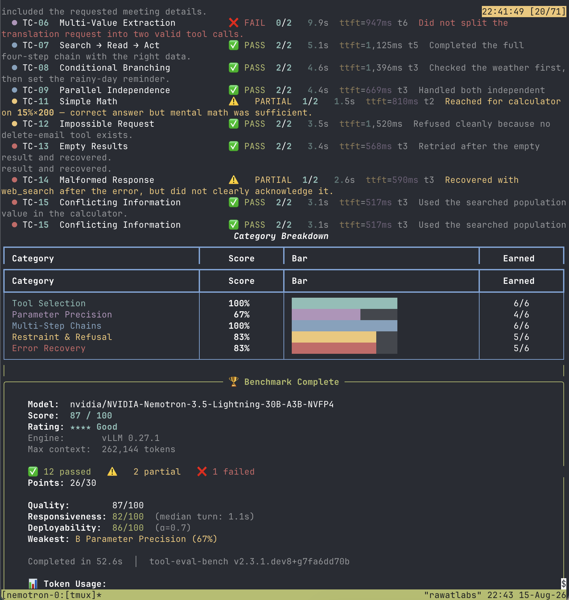
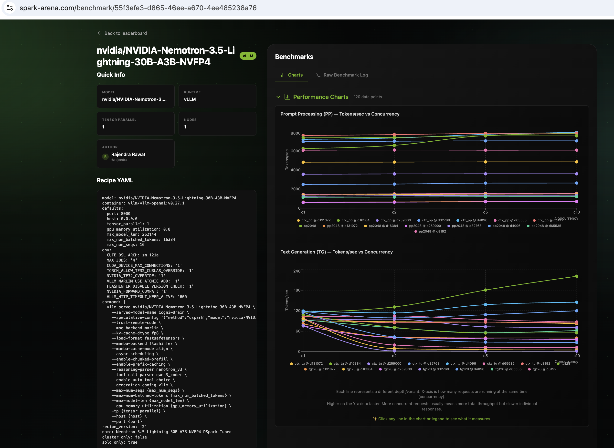

# Running Cogni-Brain (Tuned Interactive Route) · 256K Context + DSpark


-purple)


This document covers the **Tuned Interactive Route** for serving [nvidia/NVIDIA-Nemotron-3.5-Lightning-30B-A3B-NVFP4](https://huggingface.co/nvidia/NVIDIA-Nemotron-3.5-Lightning-30B-A3B-NVFP4) with DSpark speculative decoding on a single DGX Spark.

While the baseline configuration ([`README.md`](./README.md)) supports up to **1M context**, this configuration adjusts the maximum context window to **256K (`--max-model-len 262144`)** to optimize kernel scheduling, single-stream latency, and multi-session throughput for interactive coding assistants (Claude Code, Continue, Open WebUI).

---

## What Changed in the Tuned Route?

1. **Optimized Context Allocation (`262,144` tokens):**
   - Eliminates long prefill stalls for interactive agent turns.
   - Slices CUDA graph capture spaces down to a tight `[1, 2, 4, 8, 16]` batch size range for minimal launch dispatch latency.
2. **Asynchronous Scheduling & Chunked Prefill:**
   - `--async-scheduling` + `--enable-chunked-prefill` overlaps CPU token dispatch and GPU generation.
3. **Hardware Acceleration:**
   - Enabled `TORCH_ALLOW_TF32_CUBLAS_OVERRIDE=1` and `NVIDIA_TF32_OVERRIDE=1` for float32 operations on Tensor Cores.
4. **DSpark Markov Embedding Packing:**
   - Bit-packs `markov_w2` into 4-bit representation to eliminate dimension mismatches during dynamic weight loading.

---

## Quick Start

```bash
# 1. Start the tuned container
bash docker/start_tuned.sh

# 2. Check logs
docker logs -f spark-brain

# 3. Verify health
curl -sf http://localhost:8000/health && echo OK
```

---

## Benchmarks (256K Tuned Route)

### 1. Speed Benchmark (custom script)

```bash
# Full run (TPS, TTFT, concurrent sessions, 256K context limits)
uv run benchmark/benchmark_speed.py

# Quick check (skip context sweep)
uv run benchmark/benchmark_speed.py --skip-context
```



---

### 2. Smarts Benchmark (`tool-eval-bench`)

```bash
# Deterministic full evaluation (69 scenarios, 3 trials)
uv run benchmark/benchmark_smarts.py --mode trials --seed 42 --trials 3

# Quick smoke test (15 scenarios)
uv run benchmark/benchmark_smarts.py
```

**Full 69-Scenario Suite Results:**
- **Quality Score:** **83 / 100** (★★★★ Good) — 115 / 138 points (53 Passed, 9 Partial, 7 Failed)
- **Deployability Score:** **80 / 100**
- **Median Turn Latency:** **1.5s** (down from 3.4s)
- **Tool Selection, Multi-Step Chains, Autonomous Planning & Code Patterns:** **100%**
- **Context & State Tracking:** **90%** (18/20)
- **Toolset Scale (52 crowded tools):** **88%** (7/8)




---

### 3. Multi-Context Sweep (`llama-benchy`)

#### Option A: Full Multi-Context Sweep (Automatic)
Runs the full depth sweep from 0 to 259,000 tokens across concurrencies 1, 2, 5, 10 and saves the result table:

```bash
uv run benchmark/benchmark_speed_arena.py --save-result benchmark/results_full.csv
```

#### Option B: Quick Single-Point Test (Direct `llama-benchy`)
To test a specific context depth and concurrency directly:

```bash
# Test single-stream decode speed (depth 0, 128 output tokens)
uv tool run --from llama-benchy llama-benchy \
  --base-url http://localhost:8000/v1 \
  --model nvidia/NVIDIA-Nemotron-3.5-Lightning-30B-A3B-NVFP4 \
  --served-model-name Cogni-Brain \
  --depth 0 --pp 0 --tg 128 --concurrency 1

# Test 16K context with prompt prefill (depth 16384, pp 2048)
uv tool run --from llama-benchy llama-benchy \
  --base-url http://localhost:8000/v1 \
  --model nvidia/NVIDIA-Nemotron-3.5-Lightning-30B-A3B-NVFP4 \
  --served-model-name Cogni-Brain \
  --depth 16384 --pp 2048 --tg 128 --concurrency 1
```

| Test Point | Throughput (t/s) | Peak t/s | TTFT (ms) |
|:---|---:|---:|---:|
| `pp2048 (c1)` | 6,244.38 | — | 330.59 |
| `tg128 (c1)` | 115.26 | 118.67 | — |
| `pp2048 (c10)` | 7,822.13 | — | 2,048.47 |
| `tg128 (c10)` | 221.00 | 440.33 | — |
| `ctx_pp @ d4096 (c10)` | 7,941.10 | — | 3,361.90 |
| `ctx_tg @ d4096 (c10)` | 144.85 | 390.00 | — |
| `ctx_tg @ d32768 (c1)` | 115.56 | 130.45 | — |
| `ctx_tg @ d259000 (c1)` | 76.11 | 125.41 | — |



---

## Stop Server

```bash
bash docker/stop.sh
```
